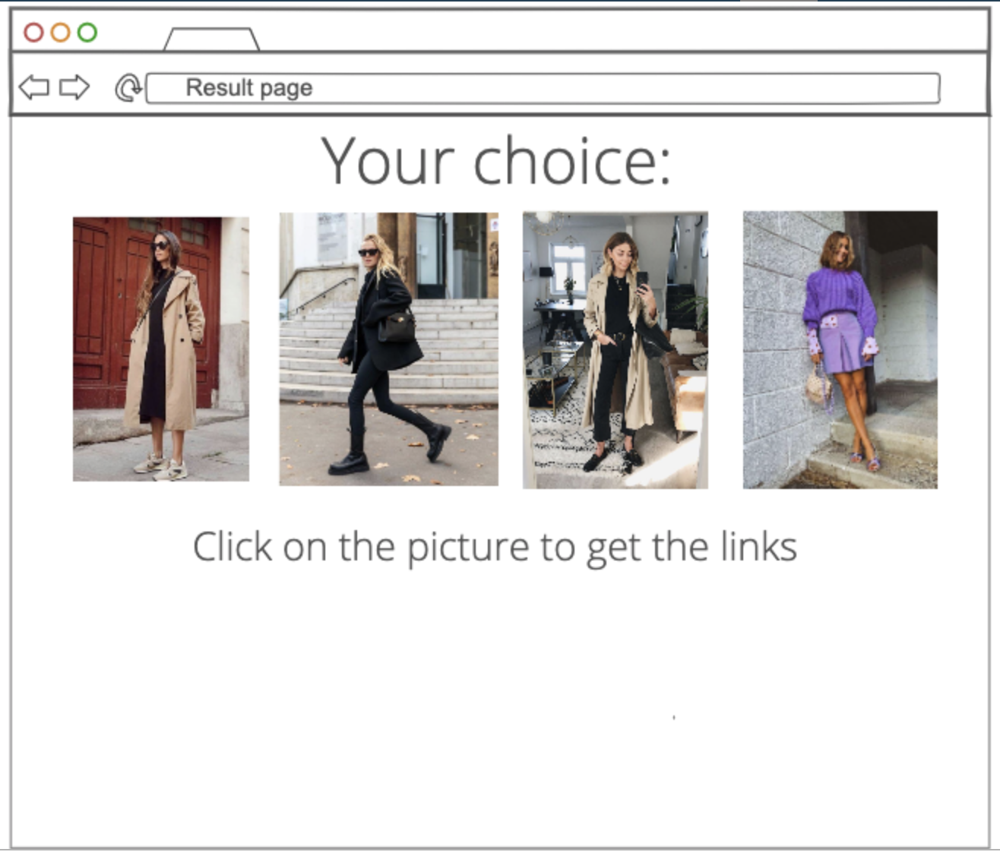

# REDI Sprint 2020 Frontend Development 2, Final Project

Application Name: {StyleList} 

Student Name: {Golovnev Sergei}

## {StyleList}

My product Stylebook allows users to find their basic wardrobe key pieces based on their style preferences. User goes through a quiz where she is asked to choose between 2 outfits, then the product picks 4 most frequently liked outfits and shown it to user. Then user clicks on them and the product provides list of items used on the pictures.

## Screenshots

## Features:

- {feature 1}
- {feature 2}
